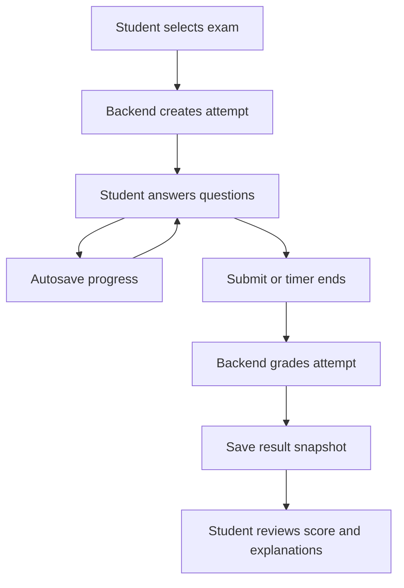
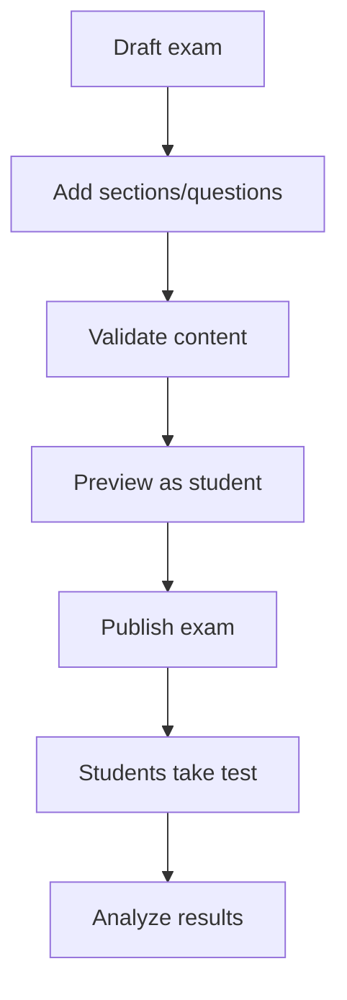

# MinPractice THPT - System Architecture

## 1. Current Status

The current website is a static MVP demo. It proves the basic user experience only:

- Browse subjects and exams
- Start a test
- Answer multiple-choice questions
- Countdown timer
- Submit test
- View score and explanations

It does not yet have a real backend, database, authentication, admin workflow, attempt history, import pipeline, or full exam lifecycle.

## 2. Target Product

MinPractice THPT is a multi-subject exam practice platform for students preparing for lower-secondary, high-school entrance, and THPT graduation exams.

The first complete version should support:

- Student account and learning history
- Subject and exam bank
- Full take-test workflow
- Auto grading
- Result review with explanations
- Admin exam management
- Question import
- Attempt analytics
- Foundation for paid/free packages later

## 3. Recommended Stack

### Backend

- Framework: NestJS
- API style: REST API first
- Auth: JWT access token, refresh token later
- Database: MongoDB with Mongoose
- Queue: BullMQ + Redis for heavy jobs later
- Storage: local/S3-compatible storage for images, audio, imported files

### Frontend

- Framework: Next.js
- Router: App Router
- UI: responsive web app, not landing-page first
- State: React state/Zustand for test session
- API client: typed service layer

### Database

Use MongoDB because exam content is document-heavy and question structures can vary by subject/type.

MongoDB fits:

- nested exam sections
- question content with options/explanations
- flexible question types
- attempt snapshots
- imported source metadata

## 4. Main Roles

| Role | Description |
|---|---|
| Guest | Can view public subjects/exams, may try sample tests |
| Student | Can take tests, save attempts, view history |
| Admin | Manages subjects, exams, questions, imports, publishing |
| Content Editor | Creates and edits exam content, cannot manage users/settings |

Teacher/class workflow is not required in the first version unless the product direction changes.

## 5. Core Modules

| Module | Backend | Frontend |
|---|---|---|
| Auth | Register, login, logout, profile | Login/register pages, user menu |
| Subjects | CRUD subjects | Subject list/filter |
| Exams | CRUD exams, publish/unpublish | Exam list, exam detail |
| Questions | CRUD question bank | Admin question editor |
| Test Session | Start, autosave, submit | Take-test screen, timer, answer sheet |
| Results | Score, review, explanation | Result page, answer review |
| Attempts | Attempt history and analytics | Student dashboard |
| Import | Import JSON/CSV/DOCX later | Admin import screen |
| Admin | Manage content/users | Admin dashboard |

## 6. Full Test Workflow



## 7. Exam Lifecycle



## 8. MongoDB Collections

### users

```json
{
  "_id": "ObjectId",
  "name": "Nguyen Van A",
  "email": "student@example.com",
  "password_hash": "...",
  "role": "student",
  "status": "active",
  "created_at": "datetime",
  "updated_at": "datetime"
}
```

### subjects

```json
{
  "_id": "ObjectId",
  "code": "math",
  "name": "Toan",
  "grade_range": ["10", "11", "12"],
  "status": "active",
  "order": 1
}
```

### exams

```json
{
  "_id": "ObjectId",
  "subject_id": "ObjectId",
  "title": "De thi thu THPT 2026 - De 01",
  "exam_type": "thpt_graduation",
  "grade": "12",
  "duration_minutes": 90,
  "total_questions": 50,
  "total_score": 10,
  "status": "published",
  "sections": [
    {
      "title": "Phan I",
      "description": "Trac nghiem",
      "question_ids": ["ObjectId"]
    }
  ],
  "created_by": "ObjectId",
  "published_at": "datetime",
  "created_at": "datetime",
  "updated_at": "datetime"
}
```

### questions

```json
{
  "_id": "ObjectId",
  "subject_id": "ObjectId",
  "type": "single_choice",
  "content": "Cau hoi...",
  "options": [
    { "key": "A", "content": "Dap an A" },
    { "key": "B", "content": "Dap an B" },
    { "key": "C", "content": "Dap an C" },
    { "key": "D", "content": "Dap an D" }
  ],
  "correct_answer": "A",
  "explanation": "Giai thich...",
  "difficulty": "medium",
  "tags": ["ham-so", "thpt-2026"],
  "status": "active",
  "created_at": "datetime",
  "updated_at": "datetime"
}
```

### attempts

```json
{
  "_id": "ObjectId",
  "user_id": "ObjectId",
  "exam_id": "ObjectId",
  "status": "in_progress",
  "started_at": "datetime",
  "submitted_at": null,
  "expires_at": "datetime",
  "answers": [
    {
      "question_id": "ObjectId",
      "answer": "A",
      "answered_at": "datetime"
    }
  ],
  "score": null,
  "correct_count": 0,
  "wrong_count": 0,
  "blank_count": 0
}
```

### attempt_results

```json
{
  "_id": "ObjectId",
  "attempt_id": "ObjectId",
  "user_id": "ObjectId",
  "exam_id": "ObjectId",
  "score": 8.2,
  "total_questions": 50,
  "correct_count": 41,
  "wrong_count": 7,
  "blank_count": 2,
  "details": [
    {
      "question_id": "ObjectId",
      "user_answer": "A",
      "correct_answer": "A",
      "is_correct": true,
      "explanation": "..."
    }
  ],
  "created_at": "datetime"
}
```

## 9. Question Types

Phase 1:

- `single_choice`
- `true_false`
- `short_answer`

Phase 2:

- `multiple_choice`
- `matching`
- `fill_blank`
- `essay`
- audio-based questions for English
- passage-based grouped questions

## 10. Backend API Draft

### Auth

| Method | Endpoint | Purpose |
|---|---|---|
| POST | `/api/auth/register` | Register student |
| POST | `/api/auth/login` | Login |
| POST | `/api/auth/logout` | Logout |
| GET | `/api/me` | Current user |

### Public Learning

| Method | Endpoint | Purpose |
|---|---|---|
| GET | `/api/subjects` | List subjects |
| GET | `/api/exams` | List published exams |
| GET | `/api/exams/{id}` | Exam detail |

### Test Attempt

| Method | Endpoint | Purpose |
|---|---|---|
| POST | `/api/exams/{id}/attempts` | Start attempt |
| GET | `/api/attempts/{id}` | Get attempt |
| PATCH | `/api/attempts/{id}/answers` | Autosave answers |
| POST | `/api/attempts/{id}/submit` | Submit and grade |
| GET | `/api/attempts/{id}/result` | Result detail |

### Student

| Method | Endpoint | Purpose |
|---|---|---|
| GET | `/api/my/attempts` | Attempt history |
| GET | `/api/my/stats` | Learning stats |

### Admin

| Method | Endpoint | Purpose |
|---|---|---|
| POST | `/api/admin/subjects` | Create subject |
| POST | `/api/admin/exams` | Create exam |
| PATCH | `/api/admin/exams/{id}` | Update exam |
| POST | `/api/admin/exams/{id}/publish` | Publish exam |
| POST | `/api/admin/questions` | Create question |
| POST | `/api/admin/imports/exams` | Import exam |

## 11. Frontend Structure

```text
apps/web
  app
    page.tsx
    login/page.tsx
    register/page.tsx
    subjects/page.tsx
    exams/page.tsx
    exams/[id]/page.tsx
    take-test/[attemptId]/page.tsx
    results/[attemptId]/page.tsx
    dashboard/page.tsx
    admin
      page.tsx
      subjects/page.tsx
      exams/page.tsx
      exams/[id]/edit/page.tsx
      questions/page.tsx
      imports/page.tsx
  components
    exam-card.tsx
    question-renderer.tsx
    answer-sheet.tsx
    countdown-timer.tsx
    result-summary.tsx
  lib
    api-client.ts
    auth.ts
    test-session.ts
  types
    exam.ts
    question.ts
    attempt.ts
```

## 12. Backend Structure

```text
apps/api
  src
    app.module.ts
    main.ts
    common
      decorators
      guards
      pipes
    modules
      auth
      users
      subjects
      exams
      questions
      attempts
      results
      admin
    database
      schemas
    config
```

## 13. Important Business Rules

- A student can start an attempt only for a published exam.
- An in-progress attempt must have an `expires_at` based on exam duration.
- Autosave should update answers without grading.
- Submit should be idempotent. Submitting twice must not create duplicate results.
- The result should snapshot question answers and explanations at submit time.
- Admin changes to questions should not change old attempt results.
- Guest attempts may be allowed for demo but should not pollute student analytics.

## 14. Build Phases

### Phase 0 - Static Demo

Status: Done.

- Static UI
- Sample data
- Browser-only grading

### Phase 1 - Real MVP

- NestJS API
- MongoDB collections
- Student auth
- Published exam listing
- Start attempt
- Autosave answers
- Submit and grade
- Attempt history

### Phase 2 - Admin CMS

- Admin login
- Subject CRUD
- Exam CRUD
- Question CRUD
- Preview and publish workflow
- Import JSON/CSV

### Phase 3 - Learning Analytics

- Student dashboard
- Weak-topic analysis
- Subject progress
- Exam recommendations

### Phase 4 - Monetization

- Free/paid exam packages
- Credits or subscriptions
- Payment integration
- Package access rules

## 15. Open Questions To Confirm

1. Should users be required to log in before taking a test, or can guests try sample exams?
2. Which subject should be built first with real data: Toan, Tieng Anh, Ngu Van, or all basic subjects?
3. Do you need teacher/class/assignment workflow now, or keep only student self-practice for version 1?
4. Will exam data be imported from JSON, Excel, Word/PDF, or entered manually in admin?
5. Should the system support paid packages in MVP, or leave payment for later?
